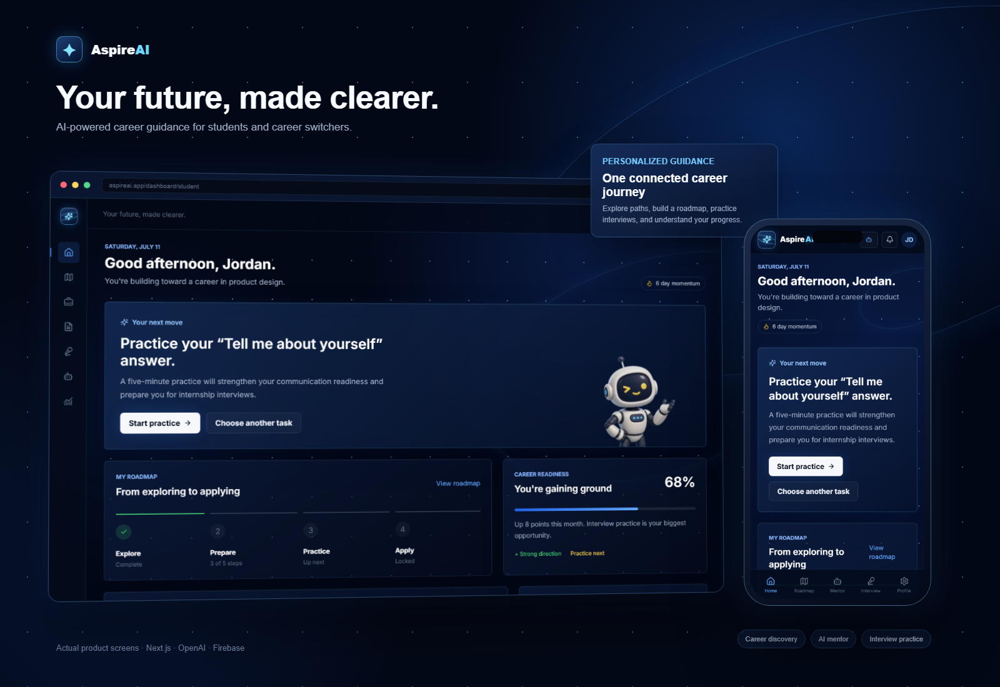
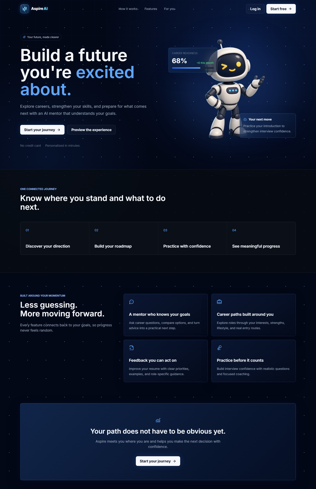
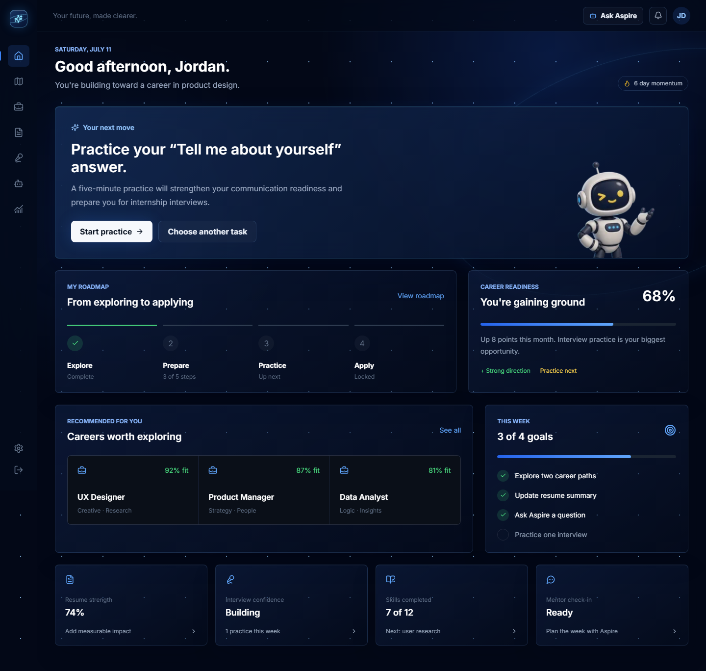
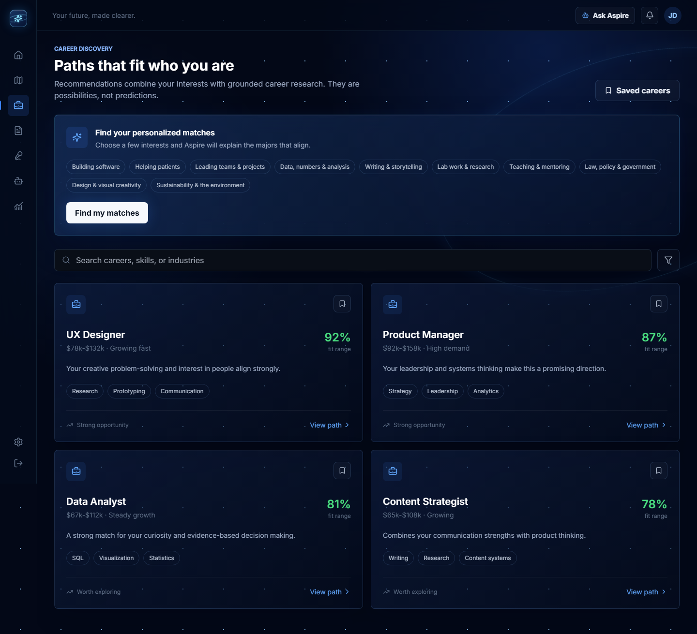
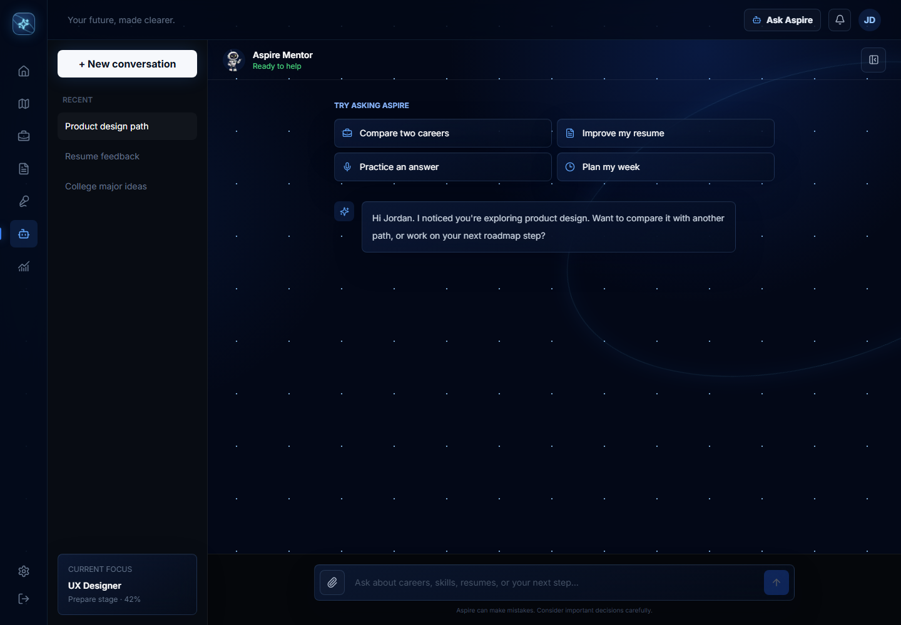

<div align="center">
  

# AspireAI

**Your future, made clearer.**

An AI-powered career guidance platform that helps users discover career opportunities, explore professional paths, and make more informed career decisions.


</div>

> [!IMPORTANT]
> **Project Status Disclaimer**
>
> AspireAI was originally developed with third-party APIs and hosted services. The interface and local application remain available as a demonstration of the product design, architecture, and intended workflows. Firebase authentication requires a valid Firebase project, while AI chat, embeddings, transcription, career matching, and interview feedback require a funded OpenAI API key. These integrations will be unavailable when credentials are missing, disabled, outdated, or limited by usage costs.



## Overview

Career planning is often fragmented across generic job lists, resume tools, interview websites, and disconnected advice. AspireAI brings those activities into one guided experience. It is designed for high school students exploring possible futures, college students preparing for internships or employment, and career switchers looking for a clearer direction.

The project began as a way to make career guidance more personal and approachable. Rather than presenting AI as a replacement for human judgment, AspireAI uses it as a mentor: it helps users interpret their interests, generate useful next steps, practice important conversations, and understand how individual actions contribute to broader career readiness.

## Implemented Features

- **Personalized dashboard** with readiness indicators, weekly goals, recommendations, milestones, and next actions.
- **Career exploration** with searchable career cards, fit indicators, saved-career affordances, and an AI-powered interest matcher.
- **Retrieval-augmented career recommendations** using local career knowledge, stored embeddings, cosine similarity, and an OpenAI explanation agent.
- **AI mentor chat** for concise career and education questions.
- **Career roadmap** organized around Explore, Prepare, Practice, and Apply stages.
- **Resume review experience** with document upload UI, strength indicators, prioritized feedback, and example improvements.
- **Mock interview setup** with role, interview type, and video, audio, or text practice modes.
- **Tailored interview preparation** generated from pasted resume text and a target job description.
- **Audio transcription and structured interview feedback** with STAR scoring, strengths, gaps, and rewrite suggestions.
- **Progress tracking** for readiness, resume strength, interview practice, and completed milestones.
- **Firebase email/password authentication** with signup, login, logout, and password update flows.
- **Responsive glassmorphism interface** with desktop navigation, mobile navigation, an original mascot, and reduced-motion support.

Some controls represent product-ready interface states but do not yet persist data to a database, including saved careers, editable profile fields, and parts of the resume-analysis demonstration.

## Product Showcase

The presentation assets use screenshots captured from the running application rather than conceptual mockups.

- [Open the editable device showcase](docs/showcase/index.html)
- [View the exported showcase image](docs/showcase/aspireai-device-showcase.png)
- [Browse the source screenshots](docs/showcase/assets)

| Landing | Dashboard |
| --- | --- |
|  |  |

| Career discovery | AI mentor |
| --- | --- |
|  |  |

## Technology Stack

| Area | Technology |
| --- | --- |
| Application | Next.js 14 App Router and Pages API routes |
| Interface | React 18, TypeScript, JavaScript, Tailwind CSS |
| Components | Lucide React, Material UI, Chakra UI, Saas UI |
| Animation | CSS animations and Framer Motion |
| Authentication | Firebase Authentication, React Firebase Hooks |
| AI | OpenAI chat completions, Whisper transcription, embeddings |
| Career intelligence | Local JSON knowledge base, precomputed embeddings, cosine-similarity RAG |
| Media | React Webcam, MediaRecorder, WAV utilities |

The current AI implementation references `gpt-4o`, `whisper-1`, and `text-embedding-3-small`. Model availability and API behavior may change over time.

## Application Routes

| Route | Screen |
| --- | --- |
| `/` | Public landing page |
| `/auth/signup` | Account registration |
| `/auth/login` | Account login |
| `/dashboard/student` | Personalized dashboard |
| `/dashboard/student/roadmap` | Career roadmap |
| `/dashboard/student/careerpath` | Career discovery and AI matching |
| `/dashboard/student/chat` | AI mentor conversation |
| `/dashboard/student/resume` | Resume review experience |
| `/dashboard/student/mockinterview` | Interview setup |
| `/dashboard/student/prep` | Tailored resume and job-description preparation |
| `/dashboard/student/mockinterview/video` | Video or audio practice session |
| `/dashboard/student/mockinterview/results` | Structured interview feedback |
| `/dashboard/student/progress` | Progress and milestones |
| `/dashboard/student/settings` | Profile, preferences, and account settings |

## Architecture

```text
Browser UI
  ├─ Firebase Authentication
  ├─ AI mentor API
  ├─ Career matching API
  │    └─ local embeddings → cosine retrieval → career agent
  └─ Interview workflow
       ├─ resume agent → research agent → interviewer agent
       └─ recording → Whisper transcription → feedback agent
```

The agent pipeline is implemented with typed, sequential functions rather than an external orchestration framework. Career and rubric knowledge are stored in `src/data`, while `src/lib/rag.ts` performs retrieval against precomputed embedding files.

## Local Setup

### Prerequisites

- Node.js 18.17 or newer
- npm
- A Firebase project for authentication features
- An OpenAI API key for AI-powered features
- A browser with microphone and camera permissions for interview practice

### 1. Install dependencies

```bash
git clone <your-repository-url>
cd aspireAI
npm install
```

### 2. Configure environment variables

Create `.env.local` in the project root:

```env
# OpenAI: chat, embeddings, transcription, and agent workflows
OPENAI_API_KEY=your_openai_api_key

# Firebase web application configuration
NEXT_PUBLIC_FIREBASE_API_KEY=your_firebase_api_key
NEXT_PUBLIC_FIREBASE_AUTH_DOMAIN=your-project.firebaseapp.com
NEXT_PUBLIC_FIREBASE_PROJECT_ID=your-project-id
NEXT_PUBLIC_FIREBASE_STORAGE_BUCKET=your-project.appspot.com
NEXT_PUBLIC_FIREBASE_MESSAGING_SENDER_ID=your_sender_id
NEXT_PUBLIC_FIREBASE_APP_ID=your_app_id
```

Never commit `.env.local` or real credentials.

### 3. Generate embeddings when knowledge content changes

Precomputed career and interview-rubric embeddings are already included. Rebuild them after editing the knowledge JSON files:

```bash
node scripts/build-embeddings.mjs
```

This command uses the configured OpenAI API and may incur usage costs.

### 4. Start development

```bash
npm run dev
```

Open [http://localhost:3000](http://localhost:3000).

### 5. Validate and build

```bash
npm run lint
npm run build
npm start
```

## Integration Availability

| Integration | Required configuration | Behavior without it |
| --- | --- | --- |
| Firebase Authentication | All `NEXT_PUBLIC_FIREBASE_*` values | Signup, login, logout, and password updates are disabled or remain in preview mode |
| OpenAI mentor | `OPENAI_API_KEY` | Chat requests fail with a recoverable error message |
| Career matching and RAG | `OPENAI_API_KEY` and valid embeddings | Personalized match generation is unavailable; static career exploration remains visible |
| Interview transcription | `OPENAI_API_KEY`, microphone access, writable temporary storage | Recorded answers cannot be transcribed |
| Tailored preparation and assessment | `OPENAI_API_KEY` | Resume/job-specific questions and rubric feedback are unavailable |

No active deployment URL, hosted database, analytics service, payment provider, or managed vector database is configured in this repository. The RAG implementation intentionally uses local JSON embeddings instead of a paid vector service.

## Project Structure

```text
src/
├── agents/                 # Career, resume, research, interview, and feedback agents
├── app/                    # Next.js routes, layouts, and feature screens
├── components/             # Shared navigation and media components
├── data/                   # Career knowledge, rubric content, and embeddings
├── lib/                    # Data helpers and local RAG implementation
└── pages/api/              # OpenAI and agent API endpoints
public/brand/               # AspireAI mascot and brand assets
docs/showcase/              # Editable device composition and product screenshots
scripts/build-embeddings.mjs
```

## Responsible Use

AspireAI recommendations are educational guidance, not guarantees of employment, salary, admission, or career fit. Users should validate important decisions with current labor-market information, educators, career professionals, and prospective employers. Avoid submitting sensitive personal information to demonstration environments.

## License

No open-source license is currently included. Unless a license is added, the repository remains under the copyright of its owner and should not be assumed to permit redistribution or commercial reuse.
